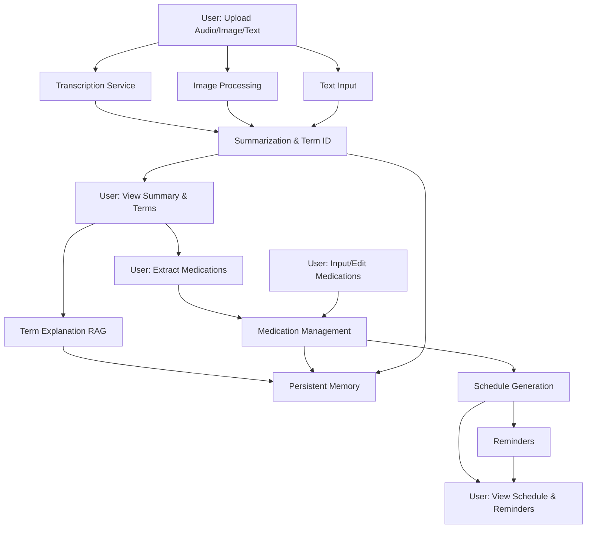
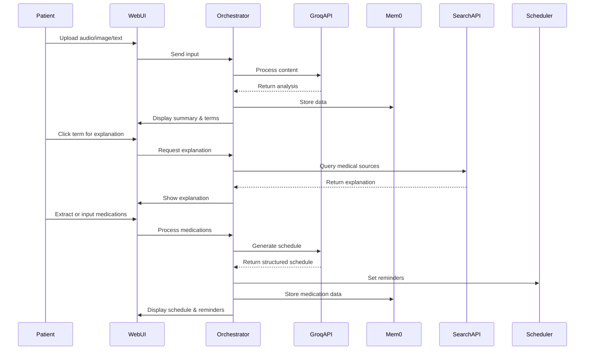

# PatientPal: Understanding Consultations & Managing Meds

## Overview of the Idea
Inspired by the challenges faced when navigating complex medical information, particularly after consultations for serious illnesses like cancer, PatientPal Agent aims to bridge the communication gap between doctors and patients/caregivers. Many find medical terminology confusing and struggle to manage complex medication regimens. This project proposes an AI agent that records (or takes text input from) doctor consultations, provides summaries in plain language, explains medical terms on demand, and helps organize medication schedules with reminders.

## Project Goal
To build and demonstrate an open-source AI agent system that assists users in:

1. Processing audio recordings or text notes from medical consultations.
2. Generating concise summaries and identifying key medical terms.
3. Providing simple, easy-to-understand explanations for selected medical terms using reliable sources (RAG).
4. Creating personalized medication schedules based on user input (from prescriptions).
5. Sending timely reminders for medication intake. We aim to showcase the practical application of AI agents, RAG, and potentially specific sponsor tools in addressing a real-world healthcare communication challenge.

## How It Works

**User Flow:**

1. The user uploads an audio recording of a doctor's consultation or pastes/types notes into the app.
2. The agent processes the input (transcription via STT if audio).
3. The agent displays a summary of the consultation and highlights potentially complex medical terms.
4. The user can click on a highlighted term.
5. The agent retrieves and presents a simplified explanation of the term using Retrieval-Augmented Generation (RAG) from a curated knowledge source.
6. The user can automatically extract medications from the consultation summary with a single click, or manually input medication details (name, dosage, frequency, timing instructions) from their prescription into a simple form or just snap the prescription label.
7. The agent parses this input, generates a structured daily/weekly medication schedule, and displays it.
8. The agent sets up and triggers notifications/reminders for upcoming medication doses.

**Core Functionality:**

- Audio Transcription (Speech-to-Text)
- Image Processing of Consultation Notes (OCR)
- Consultation Summarization (LLM)
- Medical Term Identification (NLP/LLM)
- Simplified Medical Term Explanation (RAG with LLM)
- Structured Medication Data Input & Parsing
- Automated Medication Schedule Generation
- Reminder/Notification System

**Multimodal Elements:** 

Primarily uses audio input (converted to text), image capture of consultation notes (processed via OCR), and text input/output. The output includes structured text (summaries, schedules) and notifications.

## Tools Used

- Agent Orchestration: **Agno** - To manage the workflow between transcription, summarization, RAG, scheduling, and notification tasks. 
- Persistent Memory: **Mem0**- To store conversation summaries, explained terms, and the user's medication list/schedule securely and persistently for agent recall.
- LLM Inference: **Groq API**- For fast and efficient summarization, term identification, and explanation generation via the RAG system. 
- Web Search for RAG: **Exa or Firecrawl**- Potentially used by the RAG system to search curated, reliable online medical sources (e.g., Mayo Clinic, NHS websites) for term explanations. 
- Scheduling Logic: Python schedule library or Apache Airflow.
- User Interface: Streamlit or Gradio - For rapid development of a simple, functional web interface.
- Development: Python, LangChain/LlamaIndex (potentially, for RAG implementation).

## UI Approach

A simple, clean web-based interface built with Streamlit or Gradio. Key components will include:

- An area to upload audio files or paste text.
- A display area for the transcription, summary, and highlighted terms.
- A modal or sidebar to show term explanations upon clicking.
- A dedicated form for inputting medication details.
- A clear display of the generated medication schedule.
- Status indicators for reminder settings.

## Visuals

### High-Level Architecture



### User Flow



### UI Wireframe

```
+-------------------------------------------------------+
| PatientPal                                            |
+-------------------------------------------------------+
| [Upload Audio] [Upload Image] [Paste/Type Notes]      |
+-------------------------------------------------------+
| [Process Consultation]                                |
+-------------------------------------------------------+
| Summary:                                              |
| Lorem ipsum dolor sit amet, consectetur adipiscing... |
|                                                       |
| [Extract Medications to Management Tab]               |
+-------------------------------------------------------+
| Transcription:                                        |
| Lorem ipsum dolor sit amet, consectetur adipiscing... |
+-------------------------------------------------------+
| Medical Terms:                                        |
| [hypertension] [metformin] [type 2 diabetes]          |
|                                                       |
| Explanation:                                          |
| Selected term explanation appears here...             |
+-------------------------------------------------------+
|                                                       |
| [Medication Management Tab]                           |
|                                                       |
| Metformin 500mg twice daily with meals               |
| Lisinopril 10mg once daily in the morning            |
|                                                       |
| [Generate Schedule]                                   |
|                                                       |
| Morning:                                              |
| • 8:00 AM: Lisinopril 10mg                           |
| Afternoon:                                            |
| • 12:00 PM: Metformin 500mg (with lunch)             |
| Evening:                                              |
| • 6:00 PM: Metformin 500mg (with dinner)             |
|                                                       |
| [Check Upcoming Reminders]                            |
+-------------------------------------------------------+
```


## Team Information
- **Team Lead**: [hongvin](https://github.com/hongvin)
- **Team Members**: Currently solo.
- **Background/Experience**: I have a PhD with a specialization in Artificial Intelligence and Computer Vision. Currently actively researching and deploying LLM applications, bringing strong technical expertise in the core technologies required for this project.

